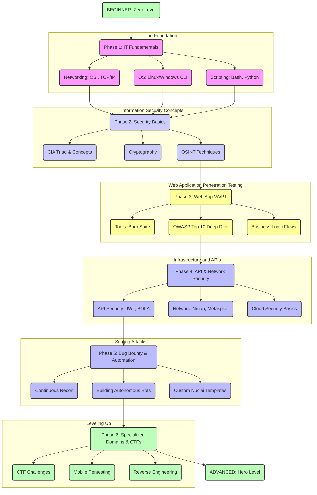

# cybersec-mastery-path
An open-source learning path for aspiring security researchers. Covers everything from basic web vulnerabilities to advanced bug bounty automation.

# 🚀 The Ultimate Zero-to-Hero Cybersecurity & Bug Bounty Roadmap

  
  
  

Welcome to the most comprehensive roadmap for mastering Vulnerability Assessment, Penetration Testing (VA&PT), and Bug Bounty Hunting. Whether you are starting from zero or looking to build autonomous security tools, this guide has you covered.

---

### 🗺️ Visual Roadmap Overview

---

## 🛠️ Phase 1: The Foundations (Prerequisites)
*Hackers don't just break things; they understand how things work better than the creators.*

### 1. Advanced Networking
- **Protocols Deep Dive:** HTTP/1.1 vs HTTP/2, TCP/UDP, DNS, FTP, SSH, SMTP.
- **Routing & Switching:** Subnetting, BGP, OSPF basics.
- **Traffic Analysis:** Mastering **Wireshark** & `tcpdump`.
- **Proxies & VPNs:** How forward and reverse proxies operate.

### 2. Operating Systems & Environments
- **Linux Mastery:** File permissions (`chmod`, `chown`), processes (`ps`, `top`), package management.
- **Environment Setup:** VirtualBox/VMware, Kali Linux, Parrot OS, and **WSL (Windows Subsystem for Linux)** for seamless terminal workflows.
- **Windows Internals:** Active Directory fundamentals, NTLM/Kerberos, PowerShell.

### 3. Scripting & Programming
- **Bash:** For chaining tools and automating terminal tasks.
- **Python:** Writing custom exploits and automation scripts (Libraries: `requests`, `BeautifulSoup`, `socket`).
- **JavaScript & Web Tech:** HTML, CSS, DOM manipulation (Crucial for finding XSS).

---

## 🔐 Phase 2: Information Security Fundamentals
*Building the hacker mindset and understanding core security concepts.*

- **Cryptography:** Symmetric vs Asymmetric encryption, Hashing (MD5, SHA), Encoding (Base64, URL), and identifying weak crypto.
- **Threat Modeling:** STRIDE, DREAD methodologies.
- **Identity & Access Management (IAM):** Authentication vs. Authorization (OAuth, SAML).
- **OSINT (Open Source Intelligence):** Google Dorking, Shodan, Github Recon, finding leaked credentials.

---

## 🕸️ Phase 3: Web Application VA&PT (The Core)
*Deep dive into web vulnerabilities.*

  

### 1. Interception & Fuzzing
- **Burp Suite:** Proxy, Repeater, Intruder, Collaborator, and essential extensions (Autorize, Logger++).
- **Fuzzing & Directory Brute-forcing:** `ffuf`, `dirsearch`, `gobuster`.

### 2. Vulnerability Deep Dive (Beyond OWASP Top 10)
- **Injection Attacks:** SQLi (Error, Union, Blind, Time-based), Command Injection, SSTI (Server-Side Template Injection).
- **Client-Side Attacks:** XSS (Reflected, Stored, DOM), CSRF, Clickjacking, CORS misconfigurations.
- **Server-Side Attacks:** SSRF (Server-Side Request Forgery), XXE (XML External Entity), LFI/RFI (Local/Remote File Inclusion).
- **Business Logic Flaws:** IDOR (Insecure Direct Object Reference), Privilege Escalation, Price Manipulation.

---

## 🔌 Phase 4: API, Cloud, & Network Security
*Modern infrastructure requires modern attacking techniques.*

### 1. API Security (REST & GraphQL)
- **Authentication Bypass:** Forging JWTs (Null signature, Algorithm confusion like RS256 to HS256).
- **API Flaws:** BOLA (Broken Object Level Authorization), Mass Assignment, Excessive Data Exposure.
- **Testing Tools:** Postman, Kiterunner, Burp Suite Active Scan.

### 2. Cloud Security (AWS, Azure, GCP)
- S3 Bucket Enumeration & Takeovers.
- IAM Privilege Escalation.
- SSRF to extract Cloud Metadata (`http://169.254.169.254/latest/meta-data/`).

---

## 🤖 Phase 5: Bug Bounty Hunting & Automation
*Scaling up your hunting game to compete on HackerOne and Bugcrowd.*

### 1. Reconnaissance Methodology
- **Vertical Correlation:** `subfinder`, `amass`, `assetfinder`.
- **Horizontal Correlation:** Finding acquisitions using Crunchbase, Reverse WHOIS.
- **Port Scanning at Scale:** `Naabu`, `Masscan`, `Nmap`.
- **Content Discovery:** Probing live hosts with `httpx`.

### 2. Tool Development & Automation
- **Custom Templates:** Writing your own **Nuclei** templates for CVEs.
- **Autonomous Bots:** Building your own background scanning engines (e.g., an autonomous bug hunter script or tool like *Sandyaa*) to monitor targets 24/7.
- **Notification Pipelines:** Sending alerts to Discord/Telegram via webhooks when a new subdomain or bug is found.

---

## 🚩 Phase 6: CTFs & Advanced Domains
*Sharpening your skills through competitions and niche domains.*

- **Capture The Flag (CTF):** Participating in Jeopardy-style events (like UMass CTF, BlueHens). Focus on Cryptography, Web, and OSINT challenges.
- **Reverse Engineering:** Learning Assembly, using Ghidra/IDA Pro, and understanding binary structures.
- **Mobile Pentesting:** Decompiling APKs (`jadx`), dynamic instrumentation (`Frida`, `Objection`), bypassing SSL pinning.

---

## 🎯 Platforms for Practice & Bounties
| Platform | Type | Focus |
| :--- | :--- | :--- |
| **HackTheBox** | Practice | Advanced Machines, CTFs |
| **PortSwigger Web Security Academy** | Practice | Web App Vulns (Highly Recommended) |
| **TryHackMe** | Practice | Guided Learning Paths |
| **HackerOne** | Bug Bounty | Public & Private Programs |
| **Bugcrowd** | Bug Bounty | VDPs and Paid Bounties |

---

## 🤝 Contribution
Want to improve this roadmap? Feel free to fork this repository, add your tools, and submit a Pull Request!

  <i>"The quieter you become, the more you are able to hear."</i>

